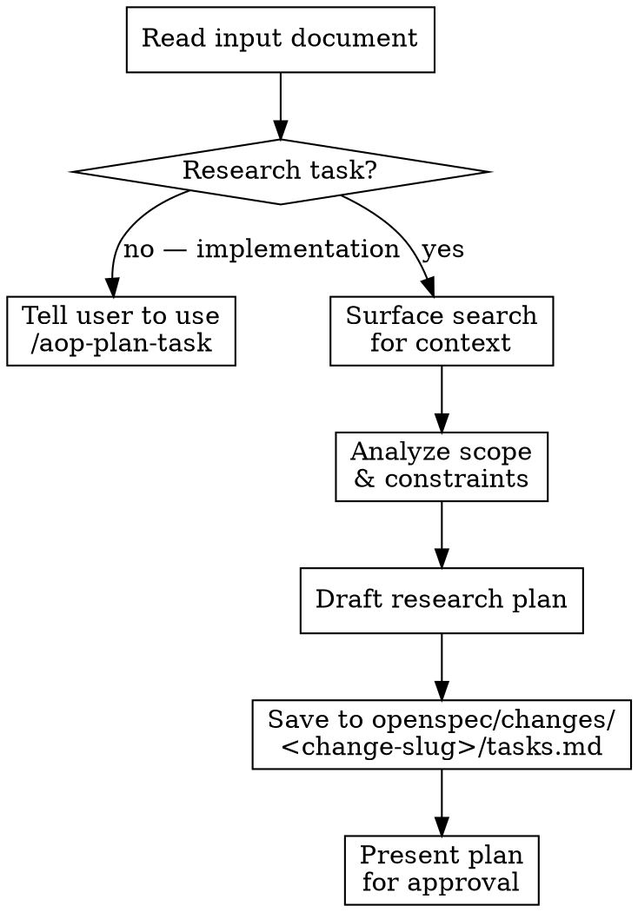

# AOP Plan Research

Read an input document and produce a structured research plan for user approval before any research begins. The plan defines what needs to be investigated — the `/aop-research` skill executes it.

## Arguments

```
/aop-plan-research <change-slug> <document|gh-issue|prompt>
```

- **`<change-slug>`** (required): The OpenSpec change slug. The plan will be saved to `openspec/changes/<change-slug>/tasks.md`. If the user does not provide a slug, ask for one before proceeding — you cannot save the plan without it.
- **`<document|gh-issue|prompt>`**: The input to plan from — a file path, GitHub issue reference, or inline text. If omitted, ask the user what to research.

## Process



### 1. Read Input Document

Read the provided document thoroughly. Identify:
- **Research questions**: What needs to be answered or understood?
- **Scope boundaries**: What's in scope vs out of scope?
- **Expected outputs**: Report, comparison, recommendation, POC?

If critical ambiguities exist, ask the user to clarify **before** proceeding to draft the plan.

### 2. Gate Check

This is a research planner. If the input document is about building, implementing, or modifying code rather than investigating or comparing options, tell the user to use `/aop-plan-task` instead and stop.

### 3. Surface Search for Context

Do lightweight web searches to understand the research landscape before writing tasks. This helps you:
- Identify the right terminology and key concepts
- Discover what sub-topics exist within the research area
- Write more targeted, specific research tasks

This is surface-level context gathering — NOT deep research. You're scoping the work, not doing the work. The `/aop-research` skill handles deep dives with full source citations.

### 4. Analyze and Draft Plan

Synthesize the document requirements into a research plan.

**Every task in the plan MUST be a research task.** The plan is a research agenda — it defines what needs to be investigated, compared, evaluated, or analyzed. The `/aop-research` skill will execute these tasks with deep web searches, source citations, and structured findings.

**Research task verbs** (use these): Investigate, Research, Compare, Analyze, Evaluate, Map, Identify, Survey, Benchmark, Document, Assess, Review

**Implementation task verbs** (do NOT use these): Build, Implement, Create, Deploy, Write, Code, Develop, Configure, Set up, Install, Migrate

**Good research tasks:**
- [ ] **Research authentication libraries compatible with Bun runtime**
- [ ] **Compare WebSocket vs SSE for real-time updates**
- [ ] **Analyze existing error handling patterns in the codebase**

**Bad — these are implementation tasks, not research:**
- [ ] **Implement JWT authentication middleware**
- [ ] **Create WebSocket connection handler**
- [ ] **Add error boundary to dashboard components**

### 5. Save and Present Plan

Write the plan to a file, then present it for approval.

**File path**: `openspec/changes/<change-slug>/tasks.md` — using the change slug provided as the first argument.

**You MUST write the plan to a file.** The plan file is the deliverable — it's what gets tracked, referenced during research, and checked off as findings are produced. Presenting the plan in chat without saving it is a failure.

After writing the file, you MUST present the plan to the user in chat:
1. Show the file path where the plan was saved
2. Provide a brief summary (what the plan covers, how many tasks, key sections)
3. Explicitly ask the user to review and approve before any research begins

**Do NOT silently save the file and move on.** The user must see the plan and confirm it.

## Output Format (STRICT)

The plan file MUST follow this exact structure. Do NOT deviate.

```markdown
# Plan: [Title derived from document]

## Summary

[2-3 sentences: what this research plan covers and the approach]

## Context

[Reference the document that was used to create the plan]
[Key findings from surface search that shaped the research agenda]
[Assumptions and scope boundaries]

## Tasks

### [Section Name — cohesive group of related research]

- [ ] **[Research task title]**
[Description of what to investigate and what the expected output is]

- [ ] **[Research task title]**
[Description]

### [Next Section Name]

- [ ] **[Research task title]**
[Description]

## Verification

- [ ] [Verification item 1]
- [ ] [Verification item 2]
- [ ] [Verification item 3]
```

### Format Rules

**Checkboxes are mandatory.** Every actionable item — in Tasks AND Verification — MUST have a `- [ ]` checkbox. This is how progress is tracked. No exceptions. No bare bullet points. No numbered lists. If it's something that needs to get done, it gets a checkbox.

**Group tasks into cohesive sections** using `### Section Name`. Group by research theme or question area, not by methodology. Section names should communicate intent (e.g., "Authentication Options", "Performance Characteristics", "Ecosystem Compatibility").

**Separate title from description.** The checkbox line has only the bold task title. The description goes on the next line(s), un-indented.

### Verification Section

The verification section items ALWAYS use `- [ ]` checkboxes. These are starting points — adapt to the specific research.

- [ ] All sources are cited and verifiable
- [ ] Key claims are cross-referenced (not single-source)
- [ ] Findings directly address the original research questions
- [ ] Output format matches what was requested (report, comparison table, recommendation, etc.)

## Guardrails

- **Always save the plan file** — The plan MUST be written to `openspec/changes/<change-slug>/tasks.md`. A plan only shown in chat is a failed invocation.
- **Always present for approval** — After saving, show the file path and summary in chat, then explicitly ask the user to approve. Never silently save and move on.
- **Plan, don't research** — Do NOT produce findings, deep analysis, or source citations. Surface searches for context are fine, but the deliverable is a plan of research tasks, not research itself. Even if the user says "just research it" — your job is ONLY the plan. The `/aop-research` skill does the actual research.
- **Research tasks only** — Every task checkbox must be a research task (investigate, compare, analyze, evaluate). Do NOT create implementation tasks (build, implement, create, deploy). If the input asks for implementation, redirect the user to `/aop-plan-task`.
- **Strict format only** — The plan file has exactly 5 top-level sections: `# Plan:`, `## Summary`, `## Context`, `## Tasks`, `## Verification`. Do NOT add extra sections like "Notes", "Success Criteria", "Deliverables", "Methodology", or anything else. All relevant information fits within the 5 required sections.
- **No horizontal rules** — Do NOT use `---` between tasks. Tasks are separated by blank lines only.
- **Clarify before planning, not during** — If the document has critical ambiguities, ask the user before drafting the plan. Don't embed unanswered questions into the plan itself.
- **Right-size the plan** — A focused research question needs 3-5 tasks, not 15. Match plan granularity to research scope.
- **One plan per invocation** — Don't try to plan multiple unrelated research topics at once.
