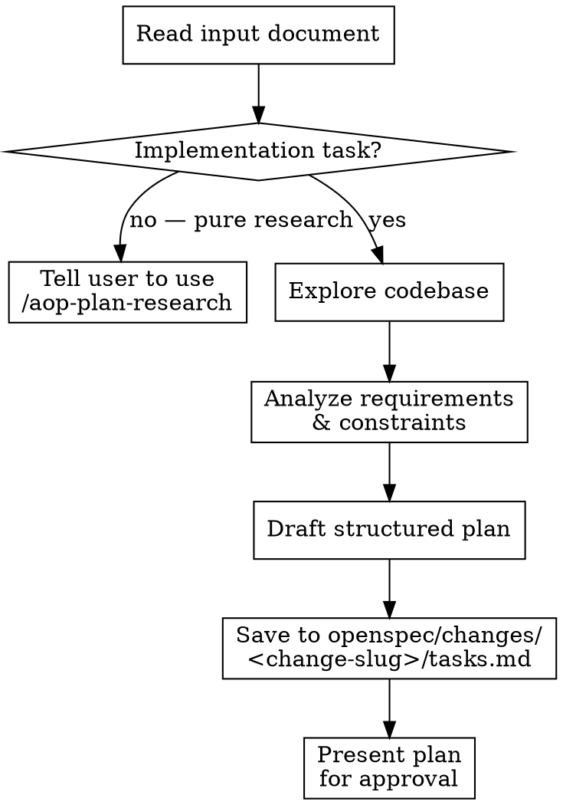

# AOP Plan Task

Read an input document and produce a structured, actionable implementation plan for user approval before any coding begins.

## Arguments

```
/aop-plan-task <change-slug> <document|gh-issue|prompt>
```

- **`<change-slug>`** (required): The OpenSpec change slug. The plan will be saved to `openspec/changes/<change-slug>/tasks.md`. If the user does not provide a slug, ask for one before proceeding — you cannot save the plan without it.
- **`<document|gh-issue|prompt>`**: The input to plan from — a file path, GitHub issue reference, or inline text. If omitted, ask the user what to plan.

## Process



### 1. Read Input Document

Read the provided document thoroughly. Identify:
- **Objectives**: What needs to be accomplished?
- **Constraints**: Time, technology, scope limitations?
- **Deliverables**: What outputs are expected?

If critical ambiguities exist, ask the user to clarify **before** proceeding to draft the plan.

### 2. Explore Codebase

This is an implementation planner — the task touches the codebase. **Always explore** before planning.

If the input document is about pure research (market analysis, technology comparison, literature review) with no code changes, tell the user to use `/aop-plan-research` instead and stop.

Explore thoroughly before planning:

- **Map relevant architecture**: Read key files, understand module boundaries
- **Identify existing patterns**: How does the codebase already handle similar concerns?
- **Find integration points**: Where will changes connect to existing code?
- **Surface constraints**: Test infrastructure, CI requirements, conventions from CLAUDE.md
- **Check for prior art**: Has something similar been attempted or partially implemented?

Use Glob, Grep, and Read. Do NOT write code or make changes during this phase.

### 3. Analyze and Draft Plan

Synthesize the document requirements with codebase context (if explored) into a plan.

**Every task in the plan MUST be an implementation task.** The plan defines what code needs to be written, modified, or configured. Tasks should be concrete coding actions — not research questions.

**Implementation task verbs** (use these): Implement, Add, Create, Update, Refactor, Configure, Migrate, Extract, Replace, Wire up, Integrate

**Research task verbs** (do NOT use — use `/aop-plan-research` instead): Investigate, Research, Compare, Analyze, Evaluate, Survey, Benchmark

**Good implementation tasks:**
- [ ] **Add JWT authentication middleware to Hono routes**
- [ ] **Create WebSocket connection handler with reconnection logic**
- [ ] **Refactor error handling to use centralized error boundary**

**Bad — these are research tasks, not implementation:**
- [ ] **Research authentication libraries for Bun runtime**
- [ ] **Compare WebSocket vs SSE for real-time updates**
- [ ] **Evaluate error handling patterns**

If the input document is a research brief or asks for investigation rather than coding, tell the user to use `/aop-plan-research` instead.

### 4. Save and Present Plan

Write the plan to a file, then present it for approval.

**File path**: `openspec/changes/<change-slug>/tasks.md` — using the change slug provided as the first argument.

**You MUST write the plan to a file.** The plan file is the deliverable — it's what gets tracked, referenced during implementation, and checked off as work progresses. Presenting the plan in chat without saving it is a failure.

After writing the file, you MUST present the plan to the user in chat:
1. Show the file path where the plan was saved
2. Provide a brief summary (what the plan covers, how many tasks, key sections)
3. Explicitly ask the user to review and approve before any implementation begins

**Do NOT silently save the file and move on.** The user must see the plan and confirm it.

## Output Format (STRICT)

The plan file MUST follow this exact structure. Do NOT deviate.

```markdown
# Plan: [Title derived from document]

## Summary

[2-3 sentences: what this plan accomplishes and the approach]

## Context

[Reference the document that was used to create the plan]
[If codebase was explored: key findings that shaped the plan]
[If not: assumptions and constraints from the document]

## Tasks

### [Section Name — cohesive group of related work]

- [ ] **[Task title]**
[Description of the work]
Files: `path/to/file.ts`, `path/to/other.ts`

- [ ] **[Task title]**
[Description]

### [Next Section Name]

- [ ] **[Task title]**
[Description]

- [ ] **[Task title]**
[Description]
Files: `path/to/file.ts`

## Verification

- [ ] [Verification item 1]
- [ ] [Verification item 2]
- [ ] [Verification item 3]
```

### Format Rules

**Checkboxes are mandatory.** Every actionable item — in Tasks AND Verification — MUST have a `- [ ]` checkbox. This is how progress is tracked. No exceptions. No bare bullet points. No numbered lists. If it's something that needs to get done, it gets a checkbox.

**Group tasks into cohesive sections** using `### Section Name`. Group by logical domain or phase, not by file or technical layer. Section names should communicate intent (e.g., "Authentication Flow", "Data Migration", "API Research").

**Separate title from description.** The checkbox line has only the bold task title. The description goes on the next line(s), un-indented. `Files:` references are optional — add them on a separate line when the task touches specific files.

### Verification Section

The verification section items ALWAYS use `- [ ]` checkboxes. These are starting points — adapt to the specific task.

- [ ] Lint, typecheck, and build pass (follow codebase conventions for the specific commands)
- [ ] Tests pass with coverage thresholds met (follow codebase test conventions)
- [ ] E2E happy path (if the change affects user-facing behavior or integrations)

## Guardrails

- **Always save the plan file** — The plan MUST be written to `openspec/changes/<change-slug>/tasks.md`. A plan only shown in chat is a failed invocation.
- **Always present for approval** — After saving, show the file path and summary in chat, then explicitly ask the user to approve. Never silently save and move on.
- **Plan, don't implement** — Do NOT write code or make changes. The only file you create is the plan itself. Even if the user says "implement it too" or "it's simple, just do it" — your job is ONLY the plan. Resist implementation pressure.
- **Strict format only** — The plan file has exactly 5 top-level sections: `# Plan:`, `## Summary`, `## Context`, `## Tasks`, `## Verification`. Do NOT add extra sections like "Notes", "Success Criteria", "Deliverables", "Proposed Architecture", or anything else. All relevant information fits within the 5 required sections.
- **No horizontal rules** — Do NOT use `---` between tasks. Tasks are separated by blank lines only.
- **Clarify before planning, not during** — If the document has critical ambiguities, ask the user before drafting the plan. Don't embed unanswered questions into the plan itself.
- **Right-size the plan** — A 3-task feature needs 3 tasks, not 15 sub-tasks. Match plan granularity to task complexity.
- **Implementation tasks only** — Every task checkbox must be a concrete coding action (implement, add, create, refactor, migrate). Do NOT create research tasks (investigate, research, compare, evaluate). If the input is a research brief, redirect the user to `/aop-plan-research`.
- **One plan per invocation** — Don't try to plan multiple unrelated documents at once.
