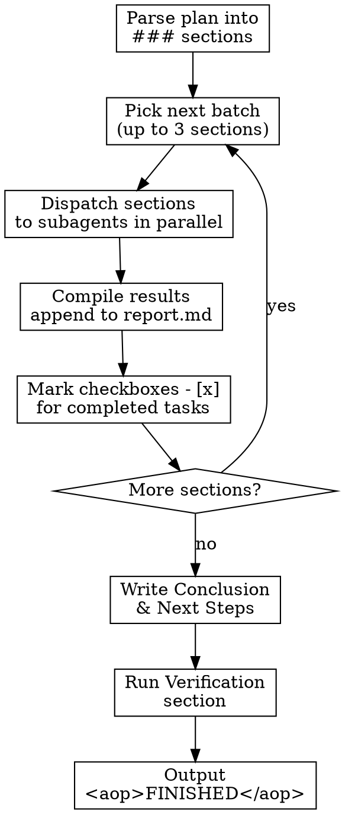

# Research

Execute research tasks from a plan file by dispatching sections to parallel subagents, compiling results into a structured report.

## Arguments

```
/aop-research <plan-file>
```

- **`<plan-file>`** (required): Path to a markdown file with `- [ ]` checkbox items (typically `openspec/changes/<slug>/tasks.md` created by `/aop-plan-research`). If not provided, ask for the path.

## Workflow



### Step 1: Parse Plan into Sections

1. Read the plan file
2. Identify `### Section Name` groups under `## Tasks`
3. Each section contains one or more `- [ ]` checkbox tasks
4. Skip sections where ALL tasks are already `- [x]` (done)
5. Count total pending sections and announce:

```
Research plan: [Title]
[N] sections to research, dispatching up to 3 in parallel
```

**If no pending sections remain**: Jump to Step 5 (Conclusion).

### Step 2: Dispatch Batch to Subagents

Pick the next **up to 3 pending sections** and dispatch each to a subagent using the Task tool **in a single message** (parallel execution).

Each subagent prompt MUST include:
- The section name and its task checkboxes (copied verbatim from the plan)
- The report file path (so the agent knows where output goes)
- The research instructions (from Step 3 below)

**Subagent prompt template:**

```
You are a research agent. Execute ALL tasks in this research section thoroughly.

## Section: [Section Name]

Tasks:
[paste the - [ ] checkboxes for this section]

## Instructions

For each task:
1. Use WebSearch to find current sources (documentation, articles, repos)
2. Use WebFetch to read primary sources directly
3. Use Read/Glob/Grep for any codebase research tasks
4. Gather 3+ sources per claim for cross-referencing
5. Include code examples when the task asks for them
6. Create code snippets or POCs when hands-on validation helps

Write your results as markdown with this structure for EACH task:

## [Task title]

[Research results]

**Sources:**
- [Source title](url) — what this source contributed

Rules:
- Every factual claim needs a source URL
- Key claims must be supported by 2+ sources
- Do NOT rely on training data alone — use WebSearch for every task
- Return ONLY the markdown sections — no preamble, no summary
```

**Use `subagent_type: "general-purpose"` for each subagent.**

### Step 3: Research Instructions (for subagents)

Subagents have access to the same tools and should:

- **Use WebSearch** to find current sources (documentation, articles, repos)
- **Use WebFetch** to read primary sources directly
- **Use Read/Glob/Grep** for codebase research tasks
- **Gather 3+ sources per claim** for cross-referencing
- **Include code examples** when the task asks for them
- **Create code snippets or POCs** when the task benefits from hands-on validation — small, exploratory code that tests an assumption or demonstrates a concept. Inline as fenced code blocks. They are research artifacts, not production code.
- **Use available skills for rich output** — skills that create charts, diagrams, images, and interactive web pages. Use them when they strengthen the research. Save generated artifacts in the same directory as the report and reference them from `report.md`.

### Step 4: Compile and Append

When subagents return:

1. **Verify quality** — check that each section has source URLs and answers the tasks
2. **Append to `report.md`** — add each section's results in plan order (not return order)
3. **Mark checkboxes** — update the plan file: `- [ ]` becomes `- [x]` for completed tasks
4. **Announce progress**:
```
Completed batch: [Section A], [Section B], [Section C]
([M] of [N] sections done)
```
5. **Signal batch done**:
```
<aop>TASK_DONE</aop>
```
6. **Loop** — if pending sections remain, go to Step 2 for the next batch

**Report file path**: Same directory as the plan — if plan is at `openspec/changes/my-research/tasks.md`, the report goes to `openspec/changes/my-research/report.md`.

**Report structure** (built incrementally, batch by batch):

```markdown
# Report: [Title from plan]

## [Task 1 title]

[Research results]

**Sources:**
- [Source title](https://url) — what this source contributed

## [Task 2 title]

[Research results]

**Sources:**
- ...
```

If `report.md` already exists (from a prior run), append to it — do NOT overwrite previous sections.

### Step 5: Conclusion & Next Steps

After ALL research sections are complete, write a final section in `report.md`:

```markdown
## Conclusion & Next Steps

[Synthesize key insights across all research sections]
[Identify patterns, trade-offs, and decision points]
[List concrete, actionable next steps — things to build, test, or investigate further]
[Suggest ideas that could spark brainstorming or open new directions]
```

This section connects the dots between individual research tasks and gives the user a springboard for what to do next.

### Step 6: Final Verification

Run through the **Verification section** in the plan file:

1. Read each verification checkbox
2. Evaluate whether the criterion is met
3. If a criterion fails, note what's missing and fix it
4. Mark each verification checkbox as `- [x]` once satisfied

### Step 7: Output Signal (REQUIRED)

After all research, conclusion, AND verification are complete:
```
<aop>FINISHED</aop>
```

## Guardrails

- **3 sections at a time** — Dispatch up to 3 sections in parallel using the Task tool. Do NOT dispatch all sections at once (resource limits) and do NOT do them sequentially (too slow). If fewer than 3 sections remain, dispatch what's left.
- **Web search is mandatory** — Subagents must NOT rely solely on training data for research. Every research task requires WebSearch/WebFetch. Training data may be outdated or incorrect.
- **Single report file** — All written research goes in `report.md`. Do NOT create per-task files, scratch files, or intermediate documents. One file, built incrementally. Skill-generated artifacts (charts, images, web pages) are the exception — save them in the same directory and reference them from `report.md`.
- **Cite everything** — Every factual claim needs a source URL. "According to the documentation" without a link is not a citation.
- **Mark checkboxes** — After each batch completes, update the plan file to mark all completed task checkboxes `- [x]`. This is how progress is tracked.
- **Plan order in report** — Append sections to `report.md` in the order they appear in the plan, not the order subagents return. This keeps the report coherent.
- **Verify before finishing** — Do NOT output `<aop>FINISHED</aop>` until you've written the Conclusion & Next Steps section AND checked every item in the plan's Verification section.
- **Always conclude** — The Conclusion & Next Steps section is mandatory. It synthesizes research into actionable items and ideas. Do NOT skip it.
